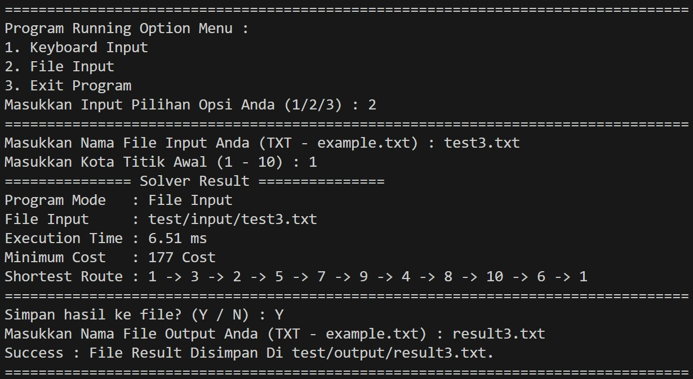
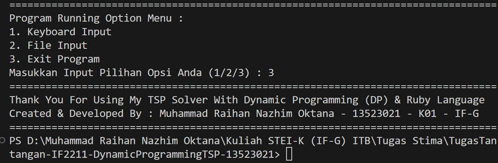

# TugasTantangan-IF2211-DynamicProgrammingTSP-13523021
IF2211 - Strategi Algoritma - Tugas Tantangan Satu Malam - Dynamic Programming TSP

## About The Project
<p align = "justify">
Program ini adalah program implementasi untuk menyelesaikan permasalahan Travelling Salesman Problem (TSP) dengan menggunakan pendekatan Dynamic Programming (DP) seperti yang telah diajarkan pada mata kuliah Strategi Algoritma (IF2211-24) Tahun Akademik 2024/2025. Dynamic Programming (DP) merupakan metode umum dalam menyelesaikan suatu permasalahan kompleks dengan memecahnya menjadi beberapa submasalah yang lebih kecil dan disimpan untuk proses selanjutnya. Program ini akan berjalan di CLI Terminal dengan input yang diasumsikan valid berupa jumlah kota dan matriks ketetanggaan, serta outputnya berupa detail dari rute terpendeknya. Program ini diketik dengan menggunakan bahasa pemrograman Ruby sebagai salah satu tantangan dari tugas ini sekaligus dikerjakan dalam satu malam sebagai tantangan utamanya.</p>

## About The Algorithm
<p align = "justify">
Dummy.</p>

## Project Feature
- Solve Travelling Salesman Problem (TSP)
- Detail Result Analysis In Terminal
- Input & Output Berupa File TXT
- Visual CLI Terminal Interaktif
- Working Error Detection

## How To Clone
Untuk clone, langsung buka terminal dan masukkan 1 command berikut:
```bash
git clone https://github.com/RNXFreeze/TugasTantangan-IF2211-DynamicProgrammingTSP-13523021
```

## How To Compile & Run
Untuk compile dan run, langsung buka terminal dan masukkan 1 command berikut:
```bash
ruby src/main.rb
```

## Author
Nama     : Muhammad Raihan Nazhim Oktana
<br>
NIM      : 13523021 / K01
<br>
Instansi : Teknik Informatika (IF-G) - Institut Teknologi Bandung (ITB)

## Program Runtime Documentation
- Program Start
  
- Input & Output File Test Case 1 [N = 3]
  
- Input & Output File Test Case 2 [N = 6]
  
- Input & Output File Test Case 3 [N = 10]
  
- Input & Output File Test Case 4 [N = 15]
  
- Input & Output File Test Case 5 [N = 20]
  
- Program Stop
  

## Closing Statement
<p align = "justify">
Demikian Tugas Tantangan Mata Kuliah Strategi Algoritma (IF2211-24) tahun 2025 ini saya persembahkan. Kepada para pengamat repository ini siapapun dan di manapun Anda berada, saya ucapkan terima kasih atas antusiasmenya yang sebesar-besarnya. Kepada dosen pengajar, saya ucapkan terima kasih atas ilmu yang telah diberikan. Serta, saya ucapkan terima kasih juga yang sebesar-besarnya kepada seluruh pihak yang telah terlibat secara langsung ataupun tidak langsung dalam membantu dan menemani saya membuat karya ini.</p>
